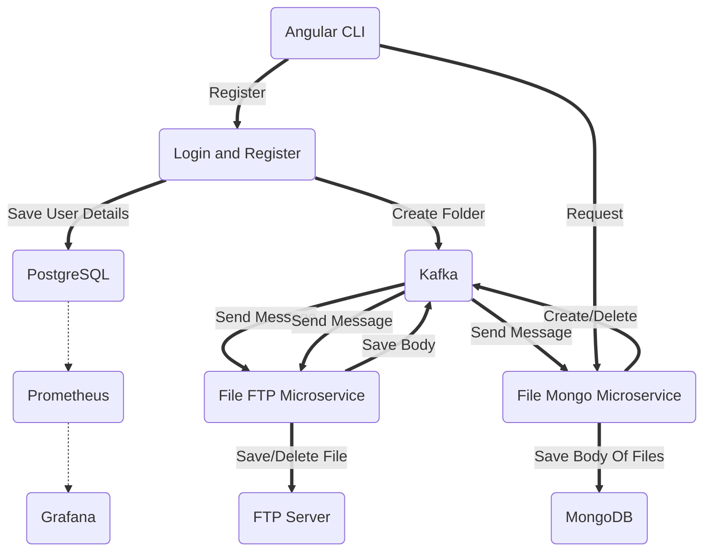

# MyDrive

Technologies in my project:
1. Java
2. Spring Framework
3. ConfigServer
4. MongoDB
5. PostgreSQL
6. Vsftpd (FTP Server)
7. Docker
8. Kafka
9. Monitoring:
	1. Prometheus 
	2. Grafana

Links to code:
1. [LoginAndRegister](https://github.com/Daniel200555/LoginAndRegister)
2. [FileFtpMicroservice](https://github.com/Daniel200555/FileFtpMicroservice)
3. [FileMongoMicroservice](https://github.com/Daniel200555/FileMongoMicroservice)
4. [ConfigServer](https://github.com/Daniel200555/ConfigServer)
5. [Docker-Compose](https://github.com/Daniel200555/runner)
6. [Angular Front-End](https://github.com/Daniel200555/angular-front)

Structure of microservices in my project:
1. LoginAndRegister: This microservice creates a new user account, saves a unique nickname, email, and encrypted password in a PostgreSQL database. After registration, it sends a message to the FileFtpMicroservice to create a folder with the user's unique nickname and another message to the FileMongoMicroservice to create a user record with a unique name to save the file bodies.
2. FileFtpMicroservice: This microservice works with an FTP server and manages user folders and files on the MyDrive site. It saves, deletes, and streams files by receiving Kafka messages from LoginAndRegister and FileMongoMicroservice.
3. FileMongoMicroservice: This microservice interacts with MongoDB to save the body of files stored on the FTP server. It also handles file deletion and renaming.
4. ConfigServer: This microservice sends configuration files to all microservices from the configuration repository on GitHub (https://github.com/Daniel200555/newconfig).
5. Server: This is a central microservice (Eureka Server) that shows the status of all connected microservices (EurekaClient) and through which the Config Server can send configuration files (.xml) to all microservices.

The next version of my project:
1. I will finish my Front-End side
2. Add Elastic Search + Kibana
3. Create new microservice which will enabled to Redis (Cash Database)
4. Add share function of files or folders
5. Run microservices via Kubernetes (I want to try create replications for microservice) + LoadBalancer

Diagram of structure my projects:

**I RUNNED ALL DATABASES AND KAFKA WITH GRAFANA IN VIRTUAL BOX (IN LOCAL SYSTEM AND NOT VIA CLOOUD SERVICES)**
